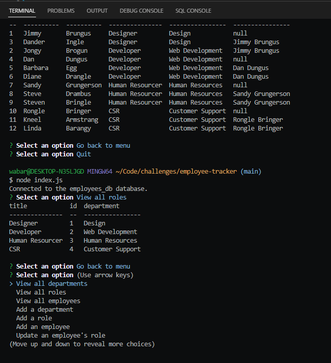

# Employee Tracker

=============================

## Description

---

- What was your motivation?
  - I wanted to created a node based application using mysql
- Why did you build this project?
  - To learn more about SQL
- What problem does it solve?
  - Allows user to track employees
- What did you learn?
  - SQL queries

## Installation

- NPM Inquirer needed to run
- Run database from schema.db and start by running index.js in console

## Usage

- Following prompts, choose to view all departments, view all roles, view all employees, add a department, add a role, add an employee, or update an employee role

